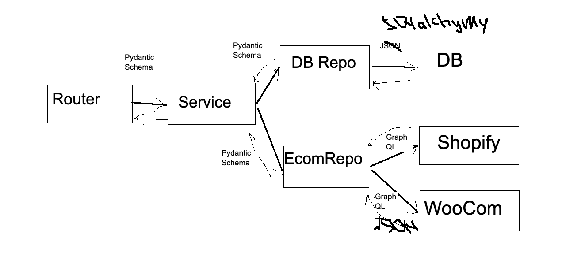

# EXAMPLE OF A NEW PROJECT ARCHITECTURE

## MAIN POINTS

### Define layers:

#### There are 4 layers from top to bottom:
  - routers: following to REST just call corresponding services
  - services: implement business logic by calling DBRepos and EcomRepos
  - repos: interact with DB and EcomPlatforms
  - models: just keep DB data

#### Layers can only strictly call non-supervising layers

#### Interaction between layers is mostly implemented by DTOs (pydantic schemas)
  - It reduces manual validations and helps discover errors earlier
  - It makes signatures for funcs/methods shorter
  - Try to avoid `*args` and `**kwargs` if you know possible arguments. Better
       define pydantic model with optional fields.

### Provide implementation in each layer with corresponding interfaces

### Define public API:

- each module should have `__all__` at the top of itself exposing only what can be used out of it.
- each package should have `__all__` in its `__init__.py` exposing only what can be used out of it.
- use relative imports for the units implemented within the same package.
- use absolute imports for the units implemented outside current package.
- usr `_Name` to no expose methods outside class/module

### Provide `Dependency Injection` and `Dependency Inversion`
- combine related logic in each layer into classes
- try to provide calls to external layers as dependency
- implement corresponding abstracts for the dependencies
- provide default values for those dependencies if it's possible
